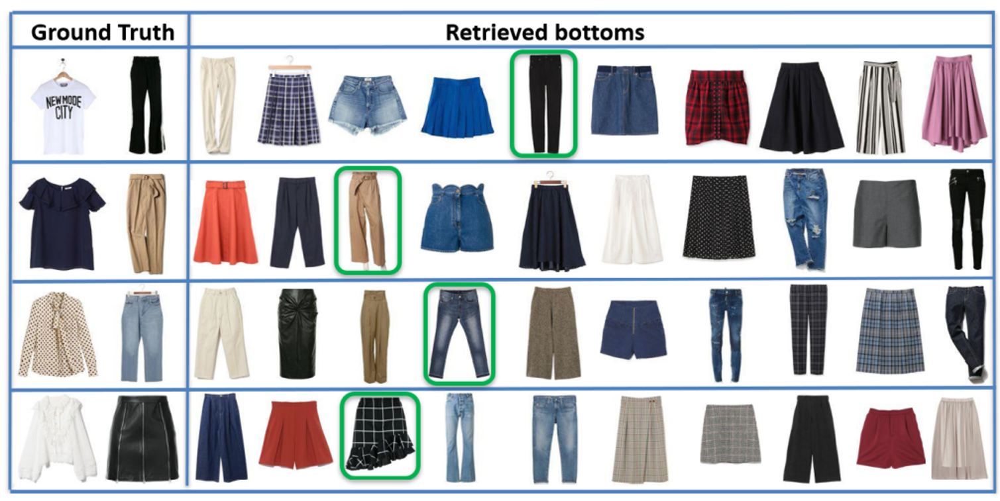

## Cross-Platform Application for Clothing Recommendation Using Neural Networks

### Introduction:
The project involves the development of a cross-platform application that leverages neural networks to recommend clothing combinations based on color theory and user preferences. 

### Project Scope:
The application aims to provide users with a digital stylist, allowing them to create a virtual wardrobe by taking photos of their clothing items. The neural networks integrated into the app suggest outfit combinations that reflect the user's mood and the specific event for which the outfit is intended. 

 

    

  

### Color Theory by Kobayashi:
The project incorporates the color theory by **Shigenobu Kobayashi**, a Japanese scholar, to categorize color combinations based on the emotions they convey. This categorization is used to recommend suitable outfit combinations aligned with the user's mood and the event they plan to attend. Kobayashi's color theory associates particular emotions with specific color combinations, creating a system that correlates a particular emotion with a combination of colors. These color combinations, known as Kobayashi triplets, are used to suggest correct outfit pairings for various occasions.

### Cross-Platform Concept:
The significance of cross-platform development is highlighted, emphasizing the need to cater to a wide user base across different devices and operating systems, particularly in the mobile-first technological landscape. Front End and Backend:
The application's front end is built using **Ionic**, **Capacitor**, and **Angular**, while the backend involves the use of neural networks for outfit recommendations.

### Neural Networks:
The project utilizes neural networks for outfit recommendations, specifically incorporating the **Style-Based Outfit Recommendation (MANN)** and Fashion2Events models. These neural networks are employed to suggest outfit combinations that reflect the user's mood and the specific event for which the outfit is intended. The MANN model is used to provide outfit recommendations based on the user's existing clothing items, while the **Fashion2Events** model is employed to align the recommendations with the intended social event. The neural networks analyze the input outfit and propose a series of coherent combinations, which are then scanned to determine the appropriate mood and event, information that is then related to the outfit itself. The project's use of neural networks aims to provide users with a versatile and intelligent clothing recommendation system that considers their mood, event, and personal style preferences. We use traditional computer vision techniques for segmentation, however more advanced systems may be employed, such as **Detectron2**.

### Technologies used:

#### Front End:
- **Ionic** : A framework used for building the application's front end
- **Capacitor**: An open-source cross-platform runtime used to build web applications
- **Angular**: A TypeScript-based open-source web application framework

#### Backend:
- **Flask**: A micro web framework used for building the backend of the application</li>

 

    

  
 
